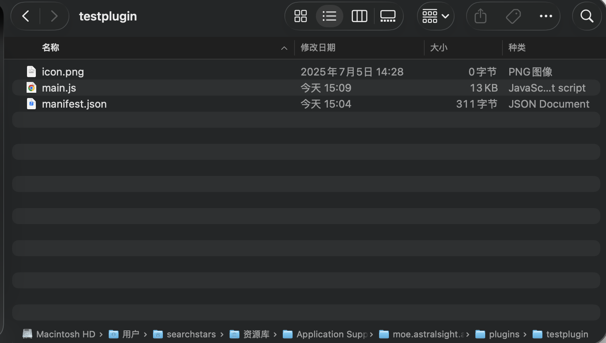

# 简介
## 关于AstroBox插件
为了提供更多的可玩性和自定义性，AstroBox 支持加载使用 JavaScript 编写的插件。AstroBox 插件提供了丰富的接口，用法简单，易于上手。

我们为 AstroBox 插件开发提供了一套基于 [Rspack](https://rspack.rs/) 的打包模板。Rspack 是一个使用 Rust 编写、几乎完全兼容 Webpack 生态的打包器，能够帮助任何 Web 前端开发人员快速入门。

## 基本信息
AstroBox的插件路径位于`%{appDataDir}/moe.astralsight.astrobox/plugins`，该文件夹下包含多个以插件名称命名的子文件夹，每个插件文件夹通常包含一个 `manifest.json` 文件以及插件的主体内容。

一个典型插件文件夹结构如下所示：

